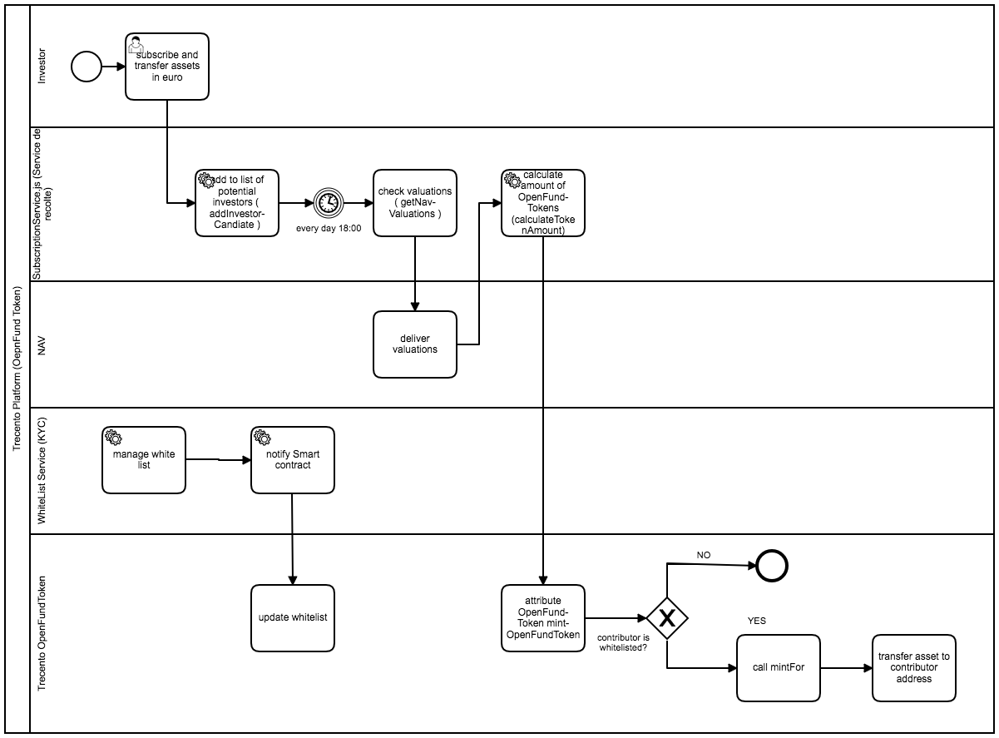

# TrecentoServicesProject

This project contains the services which will be used as middleware for the trecento Platform.

The project is implemented in nodejs using the express framework, and will host all the needed backend services for the platform.

The Services use the web3 JS libray to commuicate with smart contracts.

This project doesn't use truffle.

## Details

### Data
the services uses mock data which is not persisted.
The data will be lost bewteen the restarts of the services.

A database (for example mongoDb) can be added later to persist the data.


Example:
```
const investors = [  {id: 1, firstName: 'Jane', lastName:'Doe'}];
const funds = [  { token: 'TRCOF', name: 'openfund'}];
const subscriptions = [  { id:1, investorId: 1, token: 'TRCOF', quantity:2, subScriptionDate:'2018-03-28T15:09:16Z' }];
```

>The structure of the data when finalized will be stored in the models folder.

### Server.js
A test restful http-server to allow calling the services from the browser to display subscriptions or added investors ( GET requests).

* Example to Get existing subscriptions 
```
http://localhost:8000/api/subscriptions

```

POST requests can be send using "Postman" tool.

* Example to POST new subscriptions 


----

The test server will extended with simple forms to allow POST /PUT/ Delete without the need of other tools.
The mock data used in the services is declared in the Server.js file.

### SubscriptionService.js

Service for investors to subscribe for buying OpenFundTokens (can be later  be  extend to support other Tokens).

The service implements the following features ( see also the bpmn Process diagramm linked below "OpenFundContract_Subscribe_Process.bpmn":
* validate subscription
* add investors to list ( whitelist check is in smart contract)
* call NAV to calculate the value of the fund ( mock rates instead of NAV for the first version)
* call smart contract to transfer ether in exchange of the calculated amount of tokens 



----


## installation DEV (locally)
* install nodeJs

```
download and install from  https://nodejs.org/en/
```

* install dependencies 
```
npm install
```

* start server  
```
node server/Server.js
```
* start Browser under Default port 8000
or set other Port in the termina with the command
```
mac: export PORT=XXXX
Windows: set PORT=XXXX
```
Example:


## running tests
* mocha and chai framworks are used for testing.
* to start test use:

```
$ npm run test
```

## continous integration 

circleCi is used for continous integration 
configuration file "config.yml" is under the folder ".circleci"

tbd

## Installation INTEGRATION
tbd


## Installation PROD
tbd


